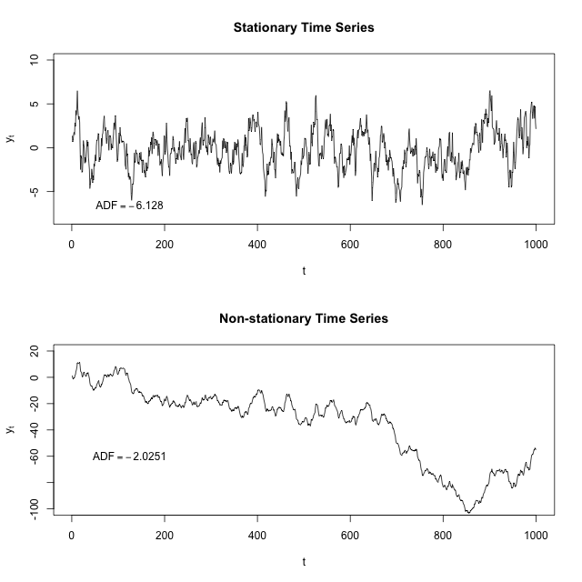

# Timeseries
Sequence of indexed data points (called observations for a real-world phenomena or realizations for an underlying stochastic process or dynamical system) ordered by an increasing (discrete) time-label. As opposed to spatial analysis, in timeseries there will usually be present some form of correlation of current observations with past ones. 

As such a stochastic process modelling such timeseries will usually reflect the dependency of data points that are temporally separated by short gaps.

## Intuition
Timeseries can be generated by a deterministic discrete or continuous-time dynamical system by simply recording the state of the system at specific sampled times. Even though the timeseries may look noisy at first this does not mean that the underlying system producing the series is stochastic. Chaotic, yet deterministic dynamical systems will in fact produce noise-like timeseries. 

To characterise a timeseries one can use a subset of its realizations (called _window_) to estimate various statistical indicators such as:
- mean;
- variance;
- skewness;
- (auto)covariance;
- (auto)correlation;
- spectrum.
All those are estimated through various techniques described in [Timeseries analysis (TSA)](./TimeseriesAnalysis.md).

_Sliding windows_ will allow the characterisation of the timeseries as a function of time.

A timeseries can be viewed as a collection of random-variables, each one associated to a single time-realization. As a result one can model a timeseries of N realizations through a multivariate N-dimensional joint probability distribution.

## Properties
A timeseries can be:
- __weakly stationary__: its mean and covariance do not change with time i.e. the mean is constant and the covariance only depends on the the lag and not the time points themselves;

- __strictly stationary__: the cdf of the joint distribution of the realizations is time-independent;
- __non-linear__: when the underlying stochastic process is non-linear;
- __multivariate__: when the realizations are vector valued random variables i.e. multivariates themselves;
- __irregular__: sampled at non-uniform time intervals or presenting gaps in the observations;
- __non-ergodic__: when the underlying stochastic process is non-ergodic.

## Examples
